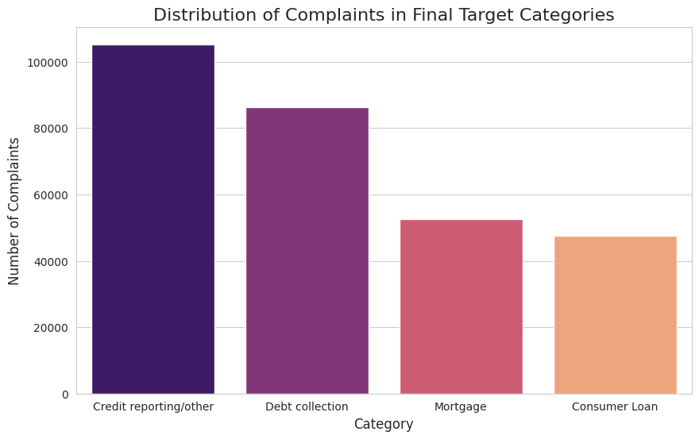
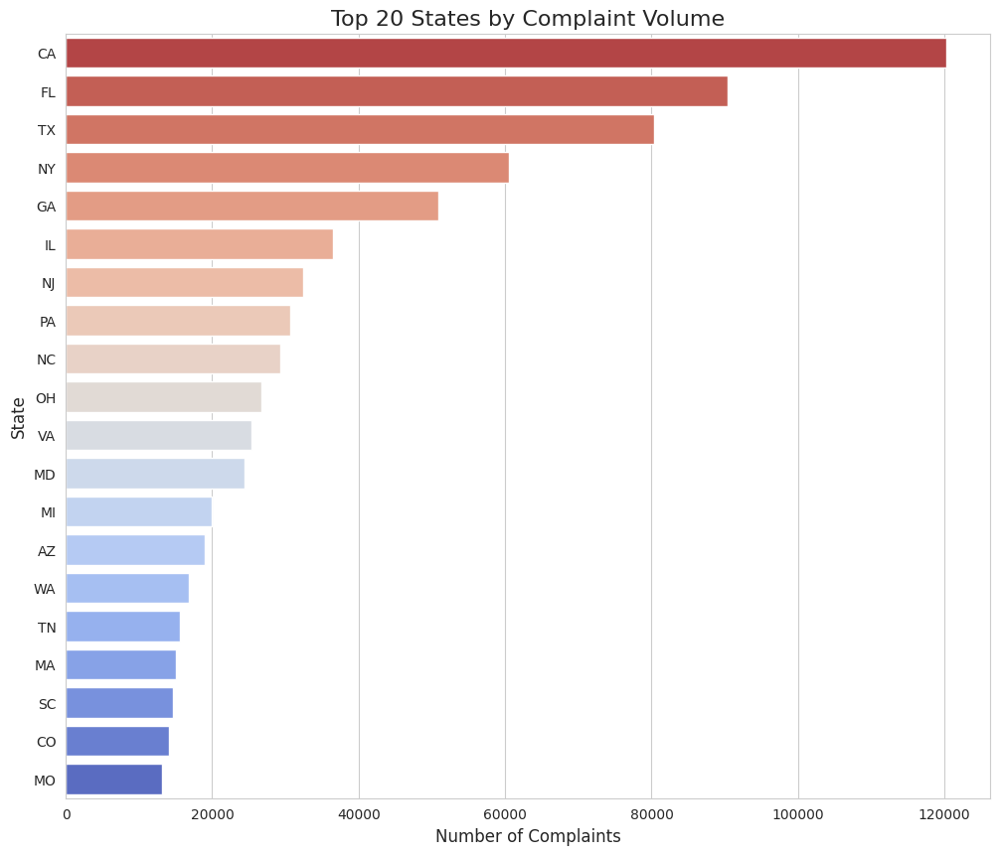
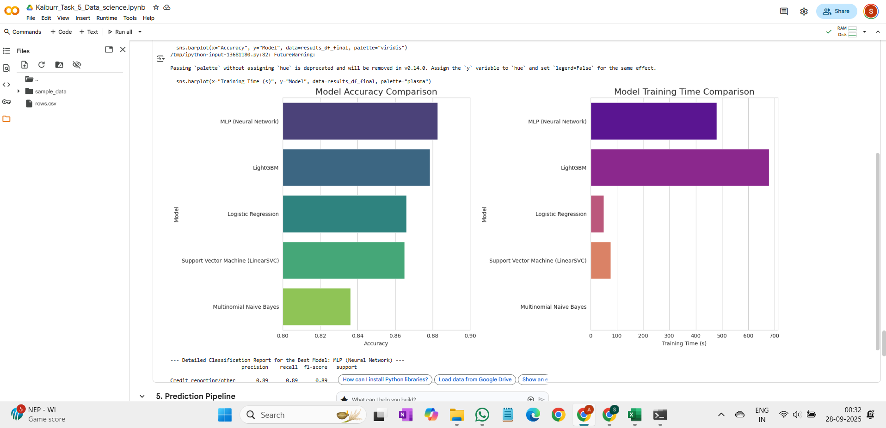

# Kaiburr Technical Assessment - Task 5: Data Science - Consumer Complaint Classification

This repository contains the solution for **Task 5** of the Kaiburr technical assessment. It is a complete data science project that builds and evaluates a machine learning model to classify consumer financial complaints. The project includes comprehensive exploratory data analysis (EDA), text pre-processing, and a comparative analysis of five different classification models.

---

## 🚀 Project Workflow

- **Full Data-to-Model Pipeline:** The project covers every step from initial data loading and cleaning to training, evaluation, and creating a final prediction function.
- **Comprehensive EDA:** In-depth exploratory data analysis was performed to understand data distributions, missing values, and key textual patterns using a variety of visualizations.
- **Advanced Text Pre-processing:** Complaint narratives were cleaned and standardized using tokenization, stop word removal, and lemmatization.
- **Comparative Model Analysis:** Five different models were trained and evaluated to find the best performer: Logistic Regression, Naive Bayes, LinearSVC, LightGBM, and a Neural Network (MLP).
- **Definitive Model Selection:** The MLP (Neural Network) was identified as the top-performing model with an accuracy of **88.27%**.

---

## 🛠️ Technology Stack

- **Language:** Python 3
- **Core Libraries:**
  - `pandas` & `numpy` for data manipulation.
  - `matplotlib` & `seaborn` for data visualization.
  - `scikit-learn` for machine learning (pre-processing, models, evaluation).
  - `nltk` for natural language processing.
  - `lightgbm` for the gradient boosting model.
  - `wordcloud` for EDA visualizations.
- **Environment:** Jupyter Notebook / Google Colab

---

## 📋 Dataset

The dataset used is the "Consumer Complaint Database" from data.gov, which contains consumer complaints received by the Consumer Financial Protection Bureau (CFPB).

- **Source:** [Consumer Complaint Database](https://catalog.data.gov/dataset/consumer-complaint-database)
- **File Used in this Repo:** `rows.csv`

---

## ⚙️ How to Run the Project

1.  **Clone the repository:**

    ```bash
    git clone https://github.com/Ashraf0705/kaiburr-task5-Data-Science.git
    cd kaiburr-task5-Data-Science
    ```

2.  **Install the required dependencies:**

    It is recommended to use a virtual environment.

    ```bash
    pip install pandas numpy matplotlib seaborn scikit-learn nltk lightgbm wordcloud jupyter
    ```

3.  **Launch and run the Jupyter Notebook:**

    ```bash
    jupyter notebook "Consumer_Complaint_Classification.ipynb"
    ```
    *(Note: Rename your notebook file to this or update the command accordingly)*

    Execute the cells in the notebook from top to bottom to replicate the analysis and results.

---

## 🧪 Results and Key Visualizations

The primary goal of the project was to find the best model for classifying complaints. The MLP (Neural Network) achieved the highest accuracy. The following screenshots highlight key findings from the analysis.

### 1. Distribution of Complaint Categories (EDA)

The initial analysis revealed a significant class imbalance, with "Credit reporting..." being the most common complaint category. This insight was crucial for the modeling phase.

<p align="center">
  
</p>

---

### 2. Geographic Distribution of Complaints (EDA)

The EDA also showed that complaints are geographically concentrated, with states like California, Florida, and Texas having the highest volumes.

<p align="center">
  
</p>

---

### 3. Final Model Performance Comparison

After training five different models, their performance was compared. The MLP (Neural Network) and LightGBM models significantly outperformed the simpler linear models, with the MLP achieving the highest accuracy.

<p align="center">
  
</p>

---

### 4. Detailed Report for the Best Model (MLP)

The winning model achieved an overall accuracy of **88.27%** and demonstrated strong, balanced performance across all four categories.
